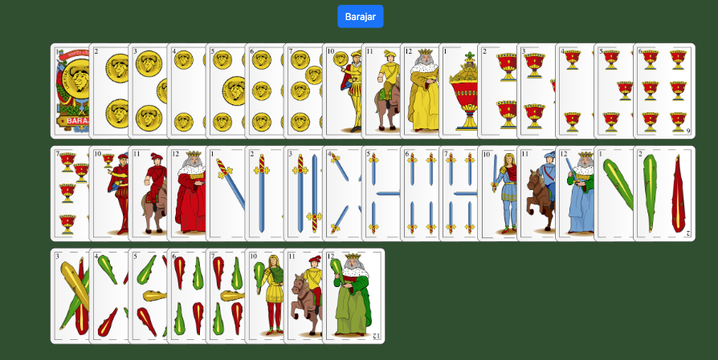
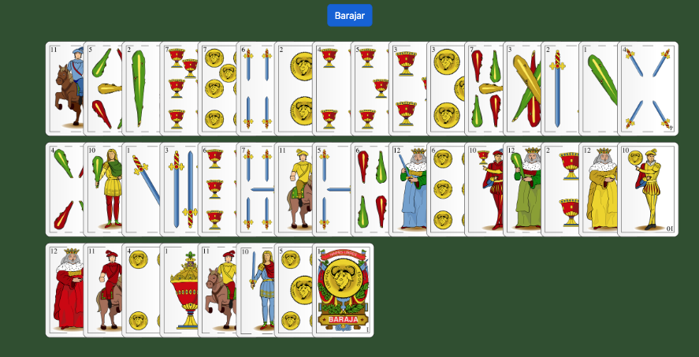
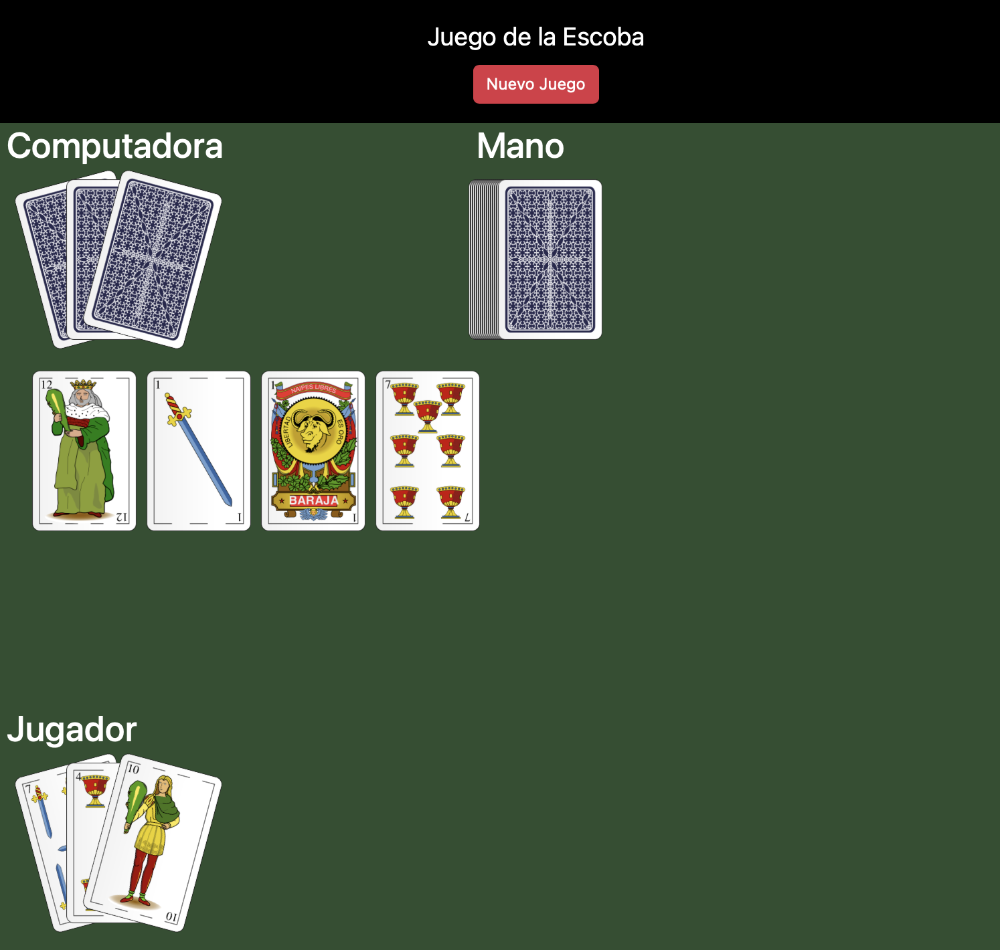

# Hitos

En esta sección se irán detallando las tareas que son necesarias realizar. Están planteadas para realizar los diferentes hitos en orden, y **elevando versión a cada paso**.

Recuerda hacer push de tu rama *release branch* (rb-usuario) y también de las tags que se corresponden a cada hito. **Recuerda ponerle el prefijo de tu usuario a la tag**: `usuario-vX.Y.Z`

- [1. Hito: Construye una baraja y represéntala en un tapete - `v0.1.0`](#1-hito-construye-una-baraja-y-represéntala-en-un-tapete---v010)
- [2. Hito: Reparte la baraja conforme a las normas del juego de la escoba - `v0.2.0`](#2-hito-reparte-la-baraja-conforme-a-las-normas-del-juego-de-la-escoba---v020)

## 1. Hito: Construye una baraja y represéntala en un tapete - `v0.1.0`

1. Revisa el código de [`src/assets/js/01-desplegar-baraja.js`](../src/assets/js/01-desplegar-baraja.js), sólo tendrás que modificar este fichero (no podrás escribir en otros)

1. Lee los comentarios y escribe tu código donde figuran las etiquetas `TODO` (elimínalas conforme vayas resolviendo)

1. El resultado deberá corresponderse con la siguiente imagen cuando abras con tu navegador el fichero [`src/01-baraja-desplegada.html`](../src/02-repartir-escoba.html)

    

1. Nota que no deben aparecer los ochos y los nueves en la baraja sobre el tapete.

1. Cuando se presione el botón `Barajar`, las cartas deben aparecer barajadas (sin repeticiones y exactamente el mismo número de cartas de la baraja).

    

1. 📚 *Pista que te será muy útil para resolverlo*: Revisa la  librería [UNDERSCORE.JS](https://underscorejs.org/#), muy popular en javascript. Te facilitará un montón de *helpers* y uno de ellos, te será especialmente útil para resolver el problema. Revisa en su documentación el apartado *Collections*.

## 2. Hito: Reparte la baraja conforme a las normas del juego de la escoba - `v0.2.0`

1. Se trata de repartir las cartas sobre el tapete de acuerdo a las normas del [*juego de la escoba*](https://es.wikipedia.org/wiki/Escoba_del_15).

2. Revisa el código de [`src/assets/js/02-repartir-escoba.js`](../src/assets/js/02-repartir-escoba.js), sólo tendrás que modificar este fichero (no podrás escribir en otros)

3. Lee los comentarios y escribe tu código donde figuran las etiquetas `TODO` (elimínalas conforme vayas resolviendo)

4. El resultado deberá corresponderse con la siguiente imagen cuando abras con tu navegador el fichero [`src/02-repartir-escoba.html`](../src/02-repartir-escoba.html)

    

5. Deberá poder advertirse por consola el valor de las manos de cada jugador y la mano pendiente de repartir (taco de cartas restantes), aunque desde su representación gráfica no se pueda advertir su valor.

6. Cuando se presione el botón `Nuevo Juego` se barajarán de nuevo las cartas y se procederá a repartirlas de nuevo (estado inicial de otro nuevo juego).
